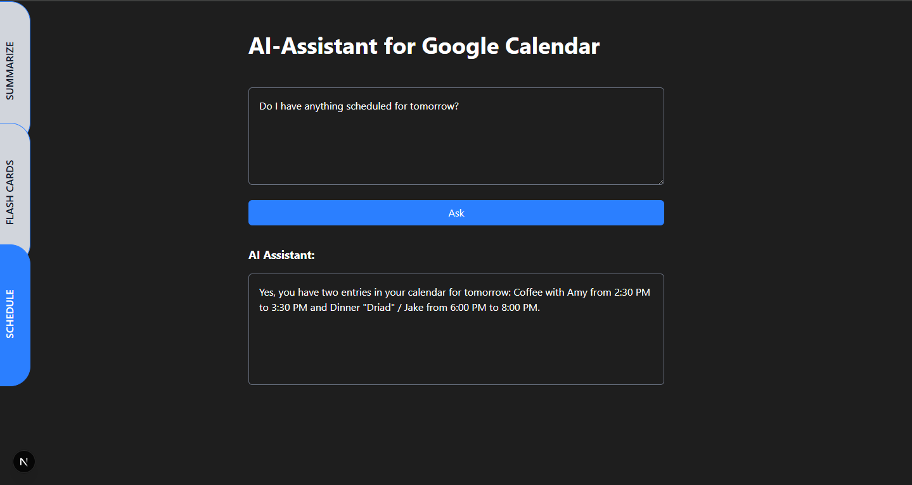

# Textify! — AI PDF Summarizer + Google Calendar Scheduling Assistant

**Textify!** is a full-stack AI productivity suite built with **Next.js (frontend)** and **FastAPI (backend)**, integrating **Gemini 2.0 Flash** and the **Google Calendar API**.

It includes two standalone tools:

---

## 1. PDF Summarizer & Quiz Generator

A document analysis tool that allows users to upload a PDF and choose from the following AI-powered actions:

- Summarize the document as a paragraph
- Summarize as bullet points
- Extract key concepts and definitions
- Generate a quiz based on the content

**Technologies:**

- Text parsing: `PyMuPDF`
- AI integration: `Gemini 2.0 Flash`
- Endpoint: `POST /chat` (handles file upload and action selection)

---

## 2. Google Calendar Scheduling Assistant

An intelligent scheduling agent that connects to your **Google Calendar** and supports:

- Natural language inputs (e.g., “next week,” “tomorrow at 2pm”)
- Checking availability within flexible or specific date ranges
- Extracting clean event titles using an LLM
- Scheduling meetings with time zone, attendee, location, and conferencing details
- Deleting meetings based on time and title

**Technologies:**

- Calendar access: `Google Calendar API`
- AI reasoning: `Gemini 2.0 Flash`
- Agent orchestration: `LangChain`
- Auth: OAuth 2 with `credentials.json` and `token.json`
- Endpoints: `/schedule`, `/availability`, etc.

---

## Tech Stack

- **Frontend:** [Next.js](https://nextjs.org/)
- **Backend:** [FastAPI](https://fastapi.tiangolo.com/)
- **AI:** [Gemini 2.0 Flash](https://ai.google.dev/)
- **Calendar Integration:** Google Calendar API
- **Tool Framework:** LangChain
- **PDF Parsing:** PyMuPDF
- **Auth:** OAuth 2.0

---

## Project Goals

- Showcase real-world AI integration with public LLM APIs
- Demonstrate LangChain agent design for scheduling and reasoning
- Provide useful tools for students, researchers, and professionals

---

## Demo Videos

