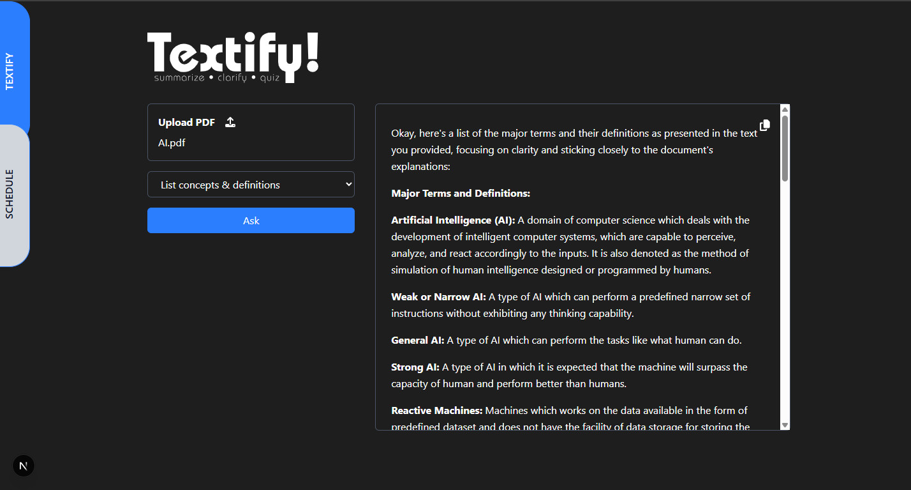

# Textify! — AI-Powered PDF Summarizer & Quiz Generator

**Textify!** is a full-stack AI tool built with **Next.js (frontend)** and **FastAPI (backend)**, integrating **Gemini 2.0 Flash (public API key, free tier)** for real-time AI processing.

This app allows users to upload a PDF and choose from intelligent AI-powered actions:

- Summarize the document as a **paragraph**
- Summarize the document into **bullet points**
- Extract **key concepts and definitions**
- Generate a **quiz** based on the content

---

## Tech Stack

- **Frontend**: [Next.js](https://nextjs.org/)
- **Backend**: [FastAPI](https://fastapi.tiangolo.com/)
- **AI Integration**: [Gemini 2.0 Flash](https://ai.google.dev/)
- **PDF Parsing**: PyMuPDF
- **Client ↔ Server Communication**: REST API (`/chat` endpoint)

---

## API Endpoint

### `POST /chat`

Handles:

- PDF file upload
- User-selected action:
  - `summarize-paragraph`
  - `summarize-bullets`
  - `list-concepts`
  - `quiz-me`

Processes the file, extracts text, and calls the Gemini API to generate an AI response.

---

## Project Purpose

This project was built to:

- Demonstrate full-stack development skills (Next.js + FastAPI)
- Explore real-world AI integration using public LLM APIs
- Solve a practical use case for students, researchers, and content creators

---

## Demo

